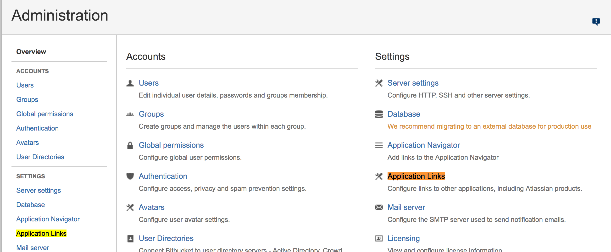
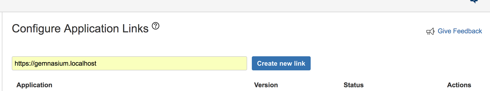
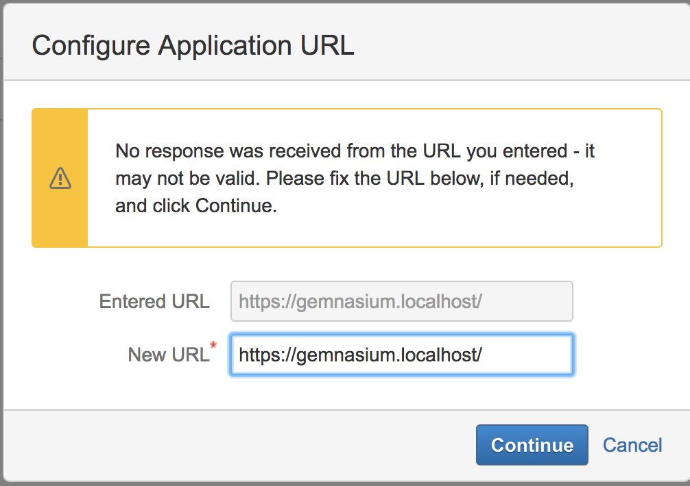
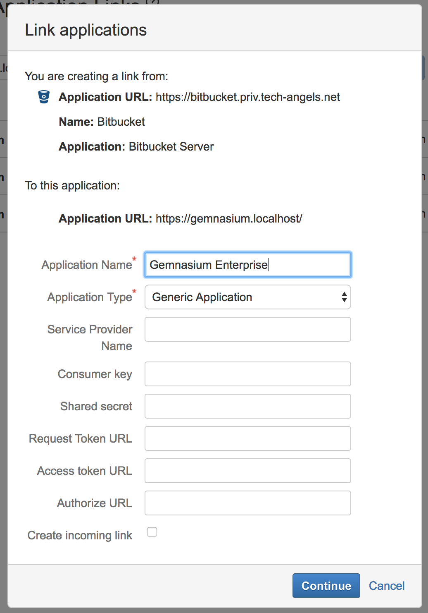
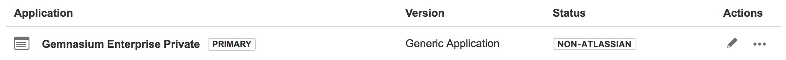
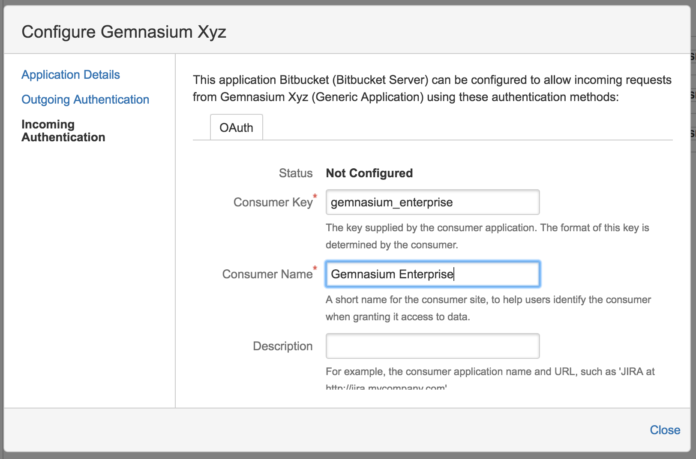
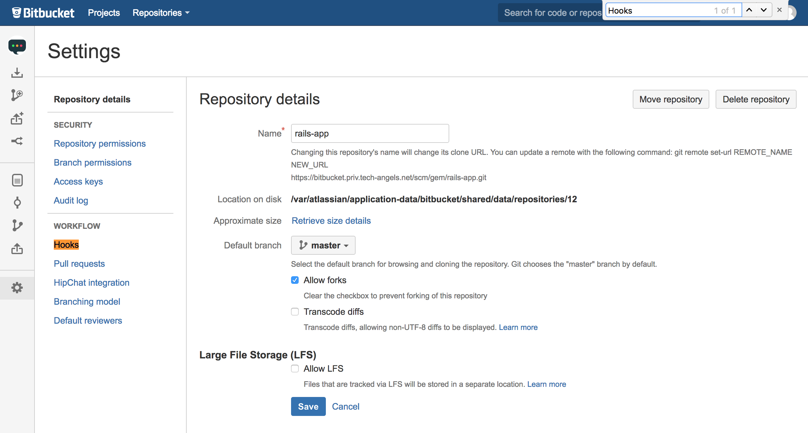
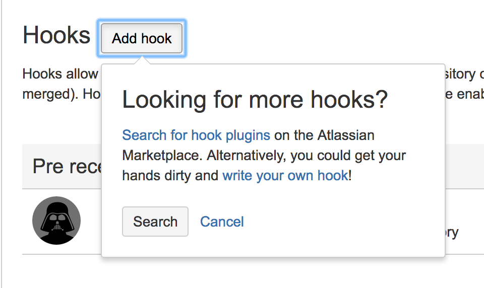
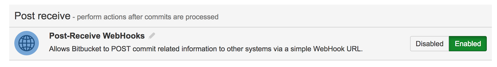
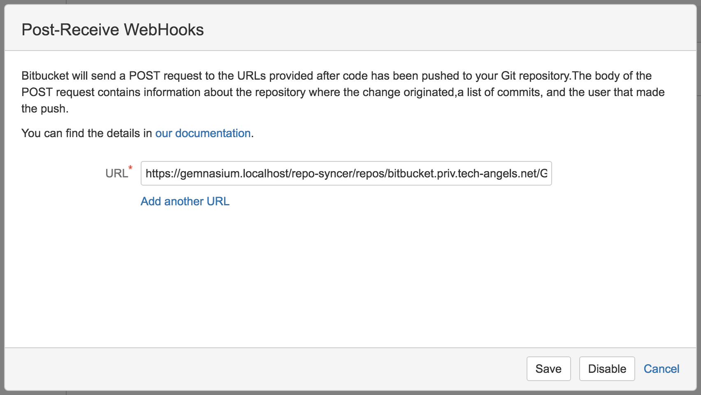

Bitbucket Server
================

Before being able to add projects from Bitbucket Server (formerly know as Atlassian Stash), Gemnasium Enterprise needs to be configured to be able to access it.

Bitbucket Server is different from the other integrations since `OAuth 1.0 <https://oauth.net/core/1.0/>`_ is being used, instead of `OAuth 2.0 <https://oauth.net/2/>`_.

First add an OAuth consumer on Bitbucket Server, then configure Gemnasium Enterprise to use that OAuth consumer.

.. _bitbucket_server_add_consumer:

Adding OAuth consumers on Bitbucket Server
^^^^^^^^^^^^^^^^^^^^^^^^^^^^^^^^^^^^^^^^^^

Before configuring Bitbucket Server, make sure you have the public key of the certificate Gemnasium Enterprise uses to sign off all the requests it sends to OAuth 1.0 providers like Bitbucket Server.
This public key is displayed when running the Gemnasium Enterprise configure script (see :ref:`configure_bbs_in_gee` below).

On Bitbucket Server, OAuth consumers are registered as a special kind of "Application Links" with an "Incoming Authentication" configuration.

To access the "Application Links" settings:

- Log in Bitbucket Server as an admin,
- Go to the settings page, or click on the gear icon that's in the upper-right corner of the page:

- Click on the "Application Links" item that's under the "SETTINGS" section of the sidebar:

Or simply visit https://[bitbucket_server]/plugins/servlet/applinks/listApplicationLinks where ``bitbucket_server`` is the hostname of your Bitbucket Server instance.

Then create a new Application Link for Gemnasium Enterprise:

- Enter the URL of your Gemnasium Enterprise instance,

(https://gemnasium.localhost is an example, use your instance URL here)

- Click on "Create new link".

Bitbucket Server then shows a warning because it's not able to probe the URL in order to configure the Application Link automatically.
You can safely ignore this warning and proceed by clicking on "Continue".

Then, fill in the mandatory fields of the "Link application" form:

- Set the Application Name to "Gemnasium Enterprise",
- Set the Application Type to "Generic Application",
- Let the other fields empty and click on "Continue".

A new Application Link shows up in the list. Click on pen icon in order to edit its properties.

Then click on "Incoming Authentication" and fill in the form:

- Set the Consumer Key to "gemnasium_enterprise",
- Set the Consumer Name to "Gemnasium Enterprise",
- Paste the Public Key that was given when configuring Gemnasium Enterprise (see :ref:`configure_bbs_in_gee` below),
- Set the Consumer Callback URL to ``{gemnasium_enterprise_url}/auth/auth/{bitbucket_hostname}`` where you replace `gemnasium_enterprise_url` with the base URL of your Gemnasium Enterprise and `bitbucket_hostname` with the hostname of your Bitbucket Server instance (example: `https://gemnasium.example.com/auth/auth/bitbucket.example.org`)
- Click on "Save".

.. IMPORTANT:: Make sure to use "gemnasium_enterprise" as the Consumer Key

Gemnasium Enterprise can now connect to Bitbucket Server using the OAuth 1.0 protocol.

.. _configure_bbs_in_gee:

Configure Gemnasium Enterprise to use Bitbucket Server
^^^^^^^^^^^^^^^^^^^^^^^^^^^^^^^^^^^^^^^^^^^^^^^^^^^^^^

A convenient script is provided to configure your instance:

.. code-block:: console

  docker exec -it gemnasium configure

When prompted, give the hostname of your Bitbucket Server instance and the OAuth Consumer Key you have registered Gemnasium Enterprise with (example: `gemnasium_enterprise`).

Your Gemnasium Enterprise users are now able to login using their Bitbucket Server account.
Also, a new repository source named "Bitbucket Server" is available on the "Add Project" screen.

Adding project webhooks
^^^^^^^^^^^^^^^^^^^^^^^

.. DANGER:: Bitbucket Server API does not provide any way to create webhooks in projects like GitHub or Gitlab (or even bitbucket.org). This operation is therefore manual, and must be executed for each project added to Gemnasium Enterprise.

Go to your Bitbucket Server project setting page, and click on the "Hooks" link.

A webhook plugin must be installed (once) to be able to notify URLs.

* Click on the "Add Hook" button, then "Search"

* A new tab will open with the Atlassian plugins marketplace
* Search for "Web Post Hooks", and select the "Bitbucket Server Web Post Hooks Plugin" plugin

.. image:: images/bitbucketserver/hook_plugin.png

Make sure you have the required permission level to install this plugin, or request the installation to an admin of your Bitbucket Server.

* Once installed, enable the plugin in the project settings:

* Click on "Post-Receive WebHooks" (or the pen next to the name) to configure the plugin

Enter the following URL:

    {gemnasium_enterprise_url}/repo-syncer/repos/{project_slug}/events

where:

* ``gemnasium_enterprise_url`` is the URL of your Gemnasium Enteprise instance, starting with https://
* ``project_slug`` is composed of ``{bitbucket_hostname}/{project}/{repo}``

In our example, the hook URL is https://gemnasium.localhost/repo-syncer/repos/bitbucket.priv.tech-angels.net/GEM/rails-app/events
and the repo URL is https://bitbucket.priv.tech-angels.net/projects/GEM/repos/rails-app/browse

